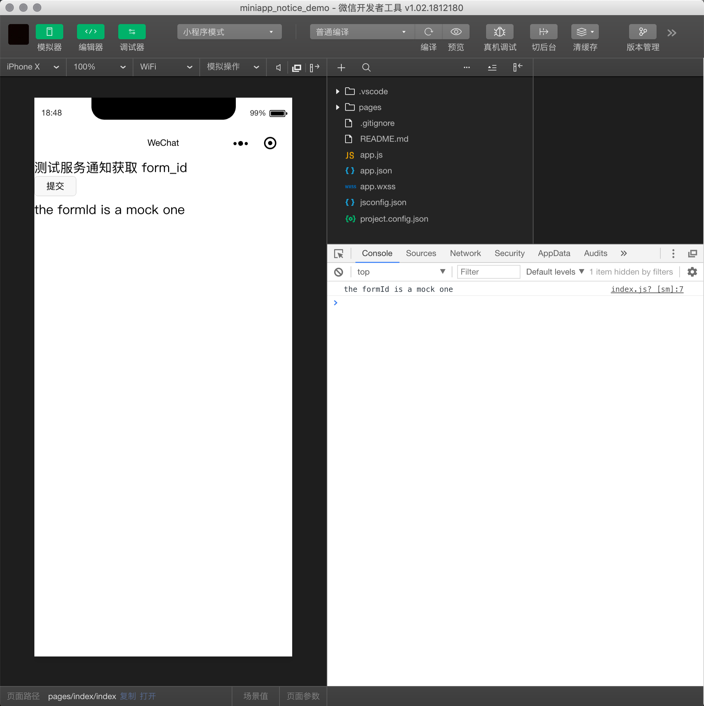

# 微信小程序 服务通知 Demo
服务通知是微信小程序直接推送信息给用户的方式，用户就无需打开小程序    
这个库的意义是给其他小程序开发者提供参考    


### 此处的代码有：
1. 小程序的代码  
2. 后端(Ruby on Rails)发送服务通知的代码     

### 文章
具体内容已经写到了博客里：   
此处仅做代码托管   


## 如何查看小程序代码？
```
git clone https://github.com/1c7/miniapp_notice_demo.git
```
然后使用"微信开发者工具"打开此文件夹即可。      


其实代码很短，为了方便懒人少点击几次鼠标，我现在直接列出来，    
你是要 git clone 还是直接复制黏贴下面的代码随你。

`index.wxml`
```html
<view>测试服务通知获取 form_id</view>
<view>
    <form bindsubmit="submit" report-submit='true'>
        <button form-type="submit" type="default" size="mini">提交</button>
    </form>
</view>
{{formID}}
```

`index.js`
```javascript
Page({
    data: {
        formID: null
    },
    submit: function(e) {
        var form_id = e.detail.formId;
        console.log(form_id);
        this.setData({
            formID: form_id
        });
        // 现在拿到了 form_id
        // 下一步就应该发给后台了
        // 后台可以把 form_id 存起来，或者马上发送服务通知，具体取决于你的业务需求
    }
});
```

## Ruby on Rails 代码


`app/controllers/xxx_controller.rb`
```ruby
  # 发送微信小程序内的服务通知
  # https://developers.weixin.qq.com/miniprogram/dev/api/sendTemplateMessage.html
  # 需要 form_id 参数
  def sendTemplateMessage
    form_id = params[:form_id]
    open_id = @current_user.wechat_openid

    access_token = return_miniapp_access_token()
    # 模板 ID
    templateID = "rmdt-gY3mEXLwlDvXQ9qPqqQXt-lfj7cI0lgz4EaiiE"
    url = "https://api.weixin.qq.com/cgi-bin/message/wxopen/template/send?access_token=#{access_token}"

    response = RestClient.post(url, {
      "touser": open_id,
      "template_id": templateID,
      "page": "index",
      "form_id": form_id,
      "data": {
        "keyword1": {
          "value": "11222333",
        },
        "keyword2": {
          "value": "2015333年01月05日 12:30",
        },
        "keyword3": {
          "value": "腾讯微信总2部",
        },
        "keyword4": {
          "value": "广州市海2珠区新港中路397号",
        },
      },
      "emphasis_keyword": "keyword1.DATA",
    }.to_json)
    render json: response
  end


  # 返回微信 access_token
  def return_miniapp_access_token
    redis = $redis

    if redis.get("wechat_miniapp_access_token")
      return redis.get("wechat_miniapp_access_token")
    end

    appid = '微信小程序 appid, 格式比如 wx3e98618e26700111'
    appsecret = '微信小程序 appsecret, 格式比如 4951119f8fe713f899e92825bad111dz'

    url = "https://api.weixin.qq.com/cgi-bin/token?grant_type=client_credential&appid=#{appid}&secret=#{appsecret}"
    r = RestClient::Request.execute(method: :get, url: url)
    r = JSON.parse(r)
    unless r["access_token"]
      return false
    end
    redis.set("wechat_miniapp_access_token", r["access_token"])
    redis.expire("wechat_miniapp_access_token", r["expires_in"].to_i - 60) # 提早 60 秒过期
    r["access_token"]
  end
```